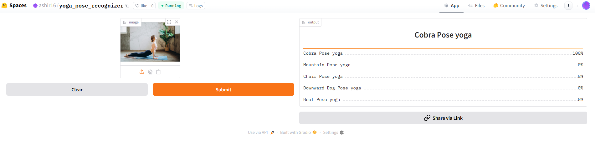

# Yoga-pose-Recognizer
An image classification model from data collection, cleaning, model training, deployment and API integration.  
The model can classify 11 different types of Yoga pose  
The types are following:  
1. Boat Pose yoga
2. Bridge Pose yoga
3. Chair Pose yoga
4. Child Pose yoga
5. Cobra Pose yoga
6. Downward Dog Pose yoga
7. Mountain Pose yoga
8. Tree Pose yoga
9. Triangle Pose yoga
10. Warrior 1 Pose yoga
11. Warrior 2 Pose yoga

# Dataset Preparation
**Data Collection:** Downloaded from DuckDuckGo using term name  
**DataLoader:** Used fastai DataBlock API to set up the DataLoader.  
**Data Augmentation:** fastai provides default data augmentation which operates in GPU.  
Details can be found in `notebooks/data_prep.ipynb`

# Training and Data Cleaning
**Training:** Fine-tuned a resnet50 model for 5 epochs (3 times) and got upto ~91% accuracy.  
**Data Cleaning:** This part took the highest time. Since I collected data from browser, there were many noises. Also, there were images that contained. I cleaned and updated data using fastai ImageClassifierCleaner. I cleaned the data each time after training or finetuning, except for the last time which was the final iteration of the model.  

# Model Deployment
I deployed to model to HuggingFace Spaces Gradio App. The implementation can be found in `deployment` folder or [here](https://huggingface.co/spaces/ashir16/yoga_pose_recognizer).  

# API integration with GitHub Pages
The deployed model API is integrated [here](https://ashir41.github.io/Yoga_pose-recognizer/) in GitHub Pages Website. Implementation and other details can be found in `docs` folder.